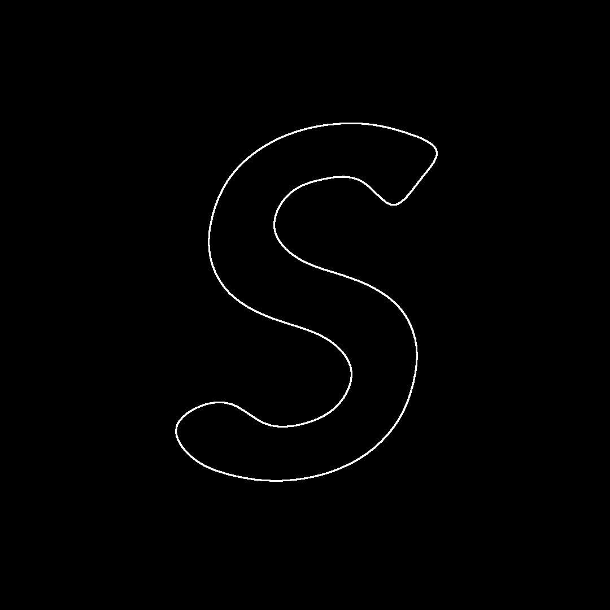

# Morphing_with_Interpolation_on_Multiple_Curves  

複数の曲線の間を補間して、モーフィングするアルゴリスム  

ジオメトリ処理や描画系の世話が面倒なので、Rhino 及び Grasshopper の関数を、Python から呼ぶことで描画に。  

  

[https://vimeo.com/319324504](https://vimeo.com/319324504)  

---  

文字のところで、2枚同じ画像が生成されているで、カクつく。  

n-1 から n で m 個に分割（最初と最後も含む）、n から n+1 で m 個に分割（最初と最後も含む）、で、分割したものを、append() で回収しているので、重複があると思われる。  

for ループを、一個手前で止めればいいので、修正は多分簡単。  

---